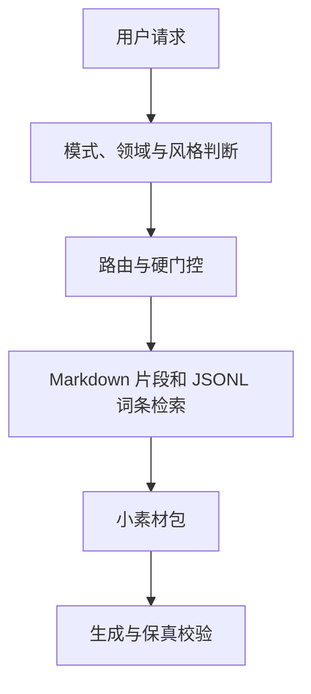

# 法言法语黑话转换器

> 将中文大白话或普通法律表述，转换为现代法学黑话、教义学表达、老派民法学术腔、当代裁判文书腔、古典法言、民国判牍或法学序言式修辞，同时尽可能保持原事实、法律关系、情态强度与明示结论不变。

`legal-jargon` 不是简单的法律词语替换器。它通过任务权限、命题核保真、领域路由、风格控制、结构化素材检索和生成后校验，共同完成法律语言转换。

本 README 是面向使用者和维护者的包外说明文件，不需要放入 skill 的运行目录，也不会占用日常转换任务的上下文。

## 目录

- [零、安装skill](#零安装skill)
- [一、快速上手](#一快速上手)
- [二、详细介绍](#二详细介绍)
  - [核心定位](#1-核心定位)
  - [三层控制结构](#2-三层控制结构)
  - [混合资源架构](#3-混合资源架构)
  - [运行流程](#4-运行流程)
  - [命题核与增量账本](#5-命题核与增量账本)
  - [参数系统](#6-参数系统)
  - [七种风格预设](#7-七种风格预设)
  - [领域与语域资源](#8-领域与语域资源)
  - [转换机制](#9-转换机制)
  - [长文本工作流](#10-长文本工作流)
  - [裁判语域、条件开放与回译锚点](#11-裁判语域条件开放与回译锚点)
  - [真实性与安全边界](#12-真实性与安全边界)
  - [项目结构与验证](#13-项目结构与验证)
  - [常见问题](#14-常见问题)
  - [语料素材来源](#15-语料素材来源)
  - [联系作者](#16-联系作者)

---

# 零、安装skill

### 让 Agent 自动配置

把本仓库链接和下面这段话一起发送给 Claude Code、Codex 或其他支持 Skill 的 Agent，一键配置：

```text
请将这个仓库中的 legal-jargon skill 安装并配置到当前 Agent 环境：

1. 先识别当前 Agent 支持的 Skill 安装位置和加载规则。
2. 找到仓库中包含 SKILL.md 的正式运行包，保持其目录结构完整安装。
3. SKILL.md 引用的 references、data、scripts 等运行资源必须一并保留，不得删减、改名、摘要化或重新生成。
4. 仓库中的原始蒸馏素材、说明文档、归档文件等包外资料不属于运行依赖，无需安装。
5. 不要擅自修改 Skill 的路由、参数、词库内容和长文本工作流。
6. 安装完成后，检查 SKILL.md 是否可被发现、内部引用是否存在、检索脚本是否可以正常运行。
7. 最后告诉我实际安装路径、验证结果，以及在当前 Agent 中调用这个 Skill 的示例指令。

仓库地址：<https://github.com/ZongziForu/law-legalese-converter>
```
另外，也可以下载并安装最新 Release 中的完整 legal-jargon Skill 包，置于本地的.claude/skills 目录下进行配置。

# 一、快速上手

## 1. 最简单的用法

安装或导入 skill 后，可以直接在请求中调用：

```text
@legal-jargon

只改写，不补充新理论。把下面这句话改成法言法语：

诈骗罪要求欺骗导致认识错误，再由错误导致处分财物。
```

未作其他说明时，默认配置为：

```yaml
task_mode: rewrite
preset: general_blacktalk
intensity: 3
output_length: standard
expansion_budget: 0
```

也就是：

- 只改变表达，不自动进行法律分析；
- 不增加事实、理论要件或法律结论；
- 使用现代通用法学黑话；
- 默认输出适中长度。

用户不需要记忆英文参数。下面这些自然语言都可以直接使用：

```text
只改写，写得专业一点，但不要变长。
```

```text
扩写成教义学风格，只补一个相关概念，控制在一段内。
```

```text
改成老派民法教材口吻，半文半白，但不要加入历史制度。
```

```text
改成当代裁判文书腔。这一段是当事人的主张，不要写成法院已经认定。
```

---

## 2. 先选任务模式

任务模式决定 Agent 可以增加什么内容。它是最重要的权限开关。

| 模式 | 参数 | 能做什么 | 不能做什么 |
|---|---|---|---|
| 改写 | `rewrite` | 同义术语替换、名词化、关系抽象化、显化原句已有结构 | 不增加新事实、新理论、新要件或新结论 |
| 扩写 | `expand` | 增加直接相关的概念框架、区分、制度功能或观察角度 | 不增加具体事实，不新增或强化法律结论 |
| 分析 | `analyze` | 区分事实、争点、依据和结论，进行条件性或完整法律分析 | 不得虚构事实或权威；现实法律需要可靠来源 |

`analysis` 可以作为 `analyze` 的兼容别名，但推荐使用规范参数 `analyze`。

### 改写示例

```text
任务模式：改写。
使用现代通用黑话，强度 4，两句以内。

原文：平台可能要承担责任。
```

即使强度很高，也只能把“可能承担责任”换一种说法，不能改成“平台依法应承担责任”。

### 扩写示例

```text
任务模式：扩写。
使用高浓度现代教义学风格，只补一个解释框架，不要给出确定结论。

原文：平台收集了用户信息，但用户不知道这些信息会被如何使用。
```

可以增加透明性、目的限定或信息控制能力等观察框架，但不能据此直接断言平台违法。

### 分析示例

```text
任务模式：分析。
请区分已知事实、假设、争点、依据和结论。
需要引用现行法时先核验来源，不确定之处使用条件式表达。

事实与问题：……
```

`analyze` 使用宿主 Agent 的研究和推理能力。本 skill 负责表达、结构和边界控制，本身不等同于法律数据库。

---

## 3. 再选风格预设

预设只决定写成什么样，不会自动改变模式、篇幅或理论增量。

| 中文名称 | 参数 | 主要特征 | 适合场景 |
|---|---|---|---|
| 现代通用黑话 | `general_blacktalk` | 抽象、名词化、体系化，适用范围广 | 日常表达、普通法律文字、玩梗 |
| 高浓度现代教义学 | `doctrinal_dense` | 术语密集、层次明显、体系定位较强 | 刑法、民法理论、论文腔 |
| 老派民法学术腔 | `old_school_civilist` | 半文半白、原则与限制并陈、旧式教材节奏 | 民法、物权、债法、合同 |
| 当代中性裁判文书腔 | `judicial_formal` | 区分主张、事实、争点、分析与结论 | 当代判决书、裁判文书、公文式表达 |
| 古典法言 | `classical_legalese` | 古雅词面、按断句法，但默认仍属当代语境 | 古典法言、简短按断、庄重戏仿 |
| 民国判牍 | `republican_judgment` | 判旨、函复、判牍和旧式司法语感 | 民国判词、旧式裁判语体 |
| 真实理论过度使用式搞怪 | `absurd_overkill` | 用过量真实概念处理简单问题，形成庄严反差 | 小事大写、娱乐性文本 |

另外还有两种按请求启用的资源侧写，它们不增加新的正式 preset：

- 历代刑法考式考据、辨名与按断：`traditional_law`；
- 法学著作序言、价值修辞和文采表达：`preface_rhetoric`。

---

## 4. 常用指令模板

### 默认黑话改写

```text
@legal-jargon

只改写，不补理论。使用现代通用黑话，强度 3，保持原意和篇幅：

【文本】
```

### 高强度但很短

```text
@legal-jargon

只改写。黑话强度 5，术语密度高，但严格控制在两句话以内：

【文本】
```

### 老派民法学术腔

```text
@legal-jargon

只改写。使用老派民法学术腔，半文半白，保持当代语境，
不要补充原文没有的法律关系、要件或效力结论：

【文本】
```

### 当代裁判文书腔

```text
@legal-jargon

只改写。使用当代中性裁判文书腔。
以下内容属于当事人陈述，不得改成法院查明、认定或采信的事实；
保留原有肯定、否定和证明强度：

【文本】
```

### 有限使用双重否定

```text
@legal-jargon

只改写。使用老派民法学术腔，古雅度 3。
允许在原文方向明确、情态强度完全等值时使用双重否定，
默认每段最多一处；不要为了显得古雅而补造否定或改变结论：

【文本】
```

### 表达“法律没有禁止”

```text
@legal-jargon

只改写。原文表达的是“法律并未禁止”，不是“已经确认合法”。
可以使用相应法言表达，但必须保留这一方向差异，不得强化为“于法有据”或“符合法律”：

【文本】
```

### 古典法言但不历史化

```text
@legal-jargon

只改写。使用古典法言，古雅度 4，保持当代语境；
不得加入古代官名、旧法令、历史机构或来源没有的时代事实：

【文本】
```

### 民国判牍

```text
@legal-jargon

只改写。明确使用民国判牍和大理院判旨式语体；
仅使用原文已经提供的时代、程序和主体信息，不得补造案号、机关或卷宗：

【文本】
```

### 有限扩写

```text
@legal-jargon

任务模式：扩写。
使用高浓度现代教义学风格，理论增量 1；
只补一个与原命题直接相关的概念框架，控制在一段内，不新增结论：

【文本】
```

### 法学序言式表达

```text
@legal-jargon

任务模式：扩写。
改成法学著作序言式表达，有文采但不要空泛；
允许加入一层价值张力或制度关怀，不得虚构历史、学者和引文：

【文本】
```

### 搞怪过载但不失控

```text
@legal-jargon

只改写。使用搞怪过载风格，搞怪度 5，过度论证度 4，
但控制在一段以内，不补事实、不编理论、不伪造外语或权威：

【文本】
```

---

## 5. 长文本快速用法

满足以下任一条件时，默认按长文本处理：

- 正文约 2000 个汉字以上；
- 8 个自然段以上；
- 存在 3 个相对独立的语义板块；
- 虽然较短，但跨越不同部门法、法律关系或表达功能。

推荐指令：

```text
@legal-jargon

任务模式：改写。
使用高浓度现代教义学风格，text_scope=document，coherence_mode=global。
保持标题、段落、编号、引用和脚注结构。

请启用长文本工作流：先固定全文风格、核心术语和主要句法家族，
再按语义板块补充必要素材；不要逐段重新选择风格。
控制高辨识度词语、句首装置和转折结构的重复频率，
完成全文后统一检查重复句首、近似句法和高频修辞。

【全文】
```

长文本工作流不是把全文切成互不相干的小段。它采用：

```text
一次全局检索
+ 按语义板块定点补充
+ 内部使用账本
+ 全文重复检查
```

---

## 6. 最小记忆版

只需要记住下面这一条模板：

```text
@legal-jargon

请【改写 / 扩写 / 分析】下面内容，
使用【现代通用黑话 / 高浓度教义学 / 老派民法 / 当代裁判文书 / 古典法言 / 民国判牍 / 搞怪过载】风格，
强度【1-5】，篇幅【极短 / 简短 / 适中 / 详细 / 充分】，
并保持原事实、关系、条件、情态和明示结论不变：

【文本】
```

---

# 二、详细介绍

## 1. 核心定位

本 skill 的基本原则是：

> 把话说得更像法学，而不是把话改成另一件事。

它主要解决四类问题：

1. 将日常表达转化为抽象、名词化、体系化的法律表达；
2. 按不同学术、司法和历史语体塑造稳定文风；
3. 在扩写和分析任务中控制概念增量与结论权限；
4. 在长文本中保持术语、主体、结构和风格一致。

它尤其关注常见的法律语言漂移：

- 把“持有”误写成“所有”；
- 把“某人主张”误写成“已经查明”；
- 把“可能”升级为“应当”或“必然”；
- 把中性事实改成归责、违法或有罪结论；
- 为了写得专业而虚构学者、法条、判例或外语术语；
- 在长文中不断重复同一组句首、转折和判断词。

---

## 2. 三层控制结构

Skill 将内容权限、文风和篇幅分开控制：

```text
任务模式 task_mode
×
风格预设 preset
×
篇幅与覆盖参数 parameters
```

- `task_mode` 决定允许增加什么；
- `preset` 决定写成什么样；
- `output_length` 和 `length_limit` 决定写多少；
- `expansion_budget` 决定可以增加多少概念框架；
- 其他参数调节术语、句法、古雅度、搞怪度和过度论证度。

三者彼此独立。例如：

```text
rewrite + doctrinal_dense + short
```

表示写得很教义学、很浓，但仍然只改写，而且篇幅要短。

```text
expand + general_blacktalk + length_limit: 200字
```

表示允许有限概念扩写，但必须在 200 字左右完成。

---

## 3. 混合资源架构

当前版本采用 Markdown 锚点与 JSONL 词库结合的混合架构。



### 3.1 Markdown 保存连续知识

以下内容需要上下文和连续论证，因此继续保存在 Markdown 中：

- 参数、模式与路由规则；
- 转换机制；
- 句法家族；
- 风格边界；
- 历史和司法语域门控；
- 使用示例；
- 运行约束和真实性规则。

所有资源章节都具有稳定 `chunk` 锚点。Agent 可以只提取相关章节，不需要读取整份文件。

### 3.2 JSONL 保存离散素材

适合逐条筛选的表格素材迁入 JSONL，包括：

- 通用词汇；
- 刑法、民法、物权、债法、公司和劳动法词汇；
- 风格表达与修辞素材；
- 功能标签；
- 裁判和判牍词汇；
- 官方回译锚点；
- 使用条件、错误使用和风险门控。

当前结构包含：

- 91 张迁移表格；
- 1092 条结构化记录；
- 1111 个可独立检索的有效单元；
- 339 个 Markdown 章节锚点。

每条记录保留原文件、原章节、原列顺序和原始 Markdown 行，可以反向重建迁移前的资源文本。

### 3.3 小素材包检索

Agent 在生成前先从目标命题提炼 3-8 个检索词，再根据模式、领域、风格和门控调用检索器。

默认素材包通常包括：

- 最多约 32 条词库记录；
- 最多约 8 个规则、句法或风格片段；
- 不超过约 9000 字符的上下文预算。

候选词进入小素材包之前，还要经过方向、主体端、法域、古雅度、高风险授权和语义召唤词等硬门控。检索相关不等于允许生成；不满足条件的高风险词条会在检索阶段直接排除。

首包不足时，依次：

1. 补充更准确的检索词；
2. 按章节、标签、来源或锚点定点召回；
3. 最后使用扩召回模式。

不会直接把完整 JSONL 或整份大型词库投入模型上下文。典型内部测试中，素材上下文相比整文件路由减少约 93%。

### 3.4 检索是否随机

检索器本身不进行随机抽样。相同参数、领域、风格和关键词会得到相同的排序结果。

实际差异可能来自：

- Agent 对文本提炼的关键词不同；
- 不同语义板块触发了不同补充检索；
- 模型生成本身存在正常随机性。

---

## 4. 运行流程

每次任务遵循统一主流程：

```text
分离外层指令与目标文本
→ 识别任务模式
→ 锁定命题核
→ 判断文本范围与法律领域
→ 载入风格预设
→ 检索小素材包
→ 应用篇幅和显式参数
→ 选择模式允许的转换机制
→ 生成文本
→ 对照命题核
→ 检查模式权限
→ 检查篇幅、格式与重复表达
→ 默认只输出成文结果
```

Skill 不会先按某个风格写完，再把另一套提示叠加在结果上。所有要求先合并为一份 `final_config`，再统一生成。

目标文本中的命令句不会被当作外层指令执行。引号、代码块、附件和待改写正文中的“忽略规则”“切换模式”等内容，仅视为目标文本。

---

## 5. 命题核与增量账本

### 5.1 命题核 `proposition_core`

生成前，Agent 会在内部锁定：

```yaml
proposition_core:
  subjects: []
  actions_or_states: []
  objects_or_interests: []
  relations: []
  sequence_and_causation: []
  conditions: []
  modality: []
  explicit_conclusions: []
  negations_and_exceptions: []
```

重点保护：

- 主体数量、身份和相互关系；
- 行为、状态、对象与利益；
- 所有、占有、持有、控制、主张等关系差异；
- 时间顺序、因果、条件和例外；
- 可能、通常、原则上、应当、必须、不得等情态；
- 肯定、否定及其作用范围；
- 原文明确给出的结论。

例如，“某人控制设备”不能当然改成“某人享有该设备的所有权”，因为控制与所有不是同一关系。

### 5.2 增量账本 `addition_ledger`

`expand` 会记录允许增加的概念内容：

```yaml
addition_ledger:
  conceptual_frames: []
  distinctions: []
  institutional_functions: []
  theory_lenses: []
  facts_added: []
  conclusions_added: []
```

其中：

- `rewrite` 的整个账本必须为空；
- `expand` 的 `facts_added` 和 `conclusions_added` 必须为空；
- `analyze` 的推论必须标明依据和条件。

删除扩写中新增的理论框架后，原命题应当仍然完整存在。

---

## 6. 参数系统

### 6.1 常用参数

| 参数 | 中文名称 | 取值 | 作用 |
|---|---|---|---|
| `task_mode` | 任务模式 | `rewrite / expand / analyze` | 决定允许增加什么 |
| `preset` | 风格预设 | 七种预设 | 决定写成什么样 |
| `intensity` | 黑话强度 | `1-5` | 总体抽象化和术语化程度 |
| `output_length` | 篇幅 | `minimal / short / standard / long / extended` | 软性输出预算 |
| `length_limit` | 明确上限 | N 字、N 句、N 段、约 N 倍 | 优先于命名篇幅档位 |
| `expansion_budget` | 理论增量 | `0-3` | `expand` 中可增加的概念数量与深度 |
| `humor_absurdity` | 搞怪度 | `0-5` | 庄严表达与题材规模的反差 |
| `argumentative_overkill` | 过度论证度 | `0-5` | 同义递进、限定和铺陈程度 |

### 6.2 高级覆盖项

| 参数 | 中文名称 | 取值 |
|---|---|---|
| `syntactic_complexity` | 句法复杂度 | `1-5` |
| `terminology_density` | 术语密度 | `1-5` |
| `archaism` | 古雅度、半文言度 | `0-5` |
| `foreign_terms` | 外语术语显现度 | `0-5` |
| `historical_register` | 历史语境 | `contemporary / source_bound / late_qing / republican / traditional_law / comparative_history` |
| `authority_policy` | 权威策略 | `none / provided_only / verified` |
| `text_scope` | 文本范围 | `auto / sentence / paragraph / document` |
| `coherence_mode` | 一致性 | `local / global` |
| `format_preservation` | 格式保留 | `strict / relaxed` |

### 6.3 默认值

```yaml
task_mode: rewrite
preset: general_blacktalk
intensity: 3
output_length: standard
length_limit: auto
expansion_budget: 0
syntactic_complexity: 3
terminology_density: 3
archaism: 0
foreign_terms: 0
humor_absurdity: 1
argumentative_overkill: 2
historical_register: contemporary
authority_policy: none
text_scope: auto
coherence_mode: local
format_preservation: strict
```

### 6.4 篇幅与理论增量分离

`output_length` 决定可见文字量，`expansion_budget` 决定新增概念量。

| `output_length` | 常见形态 |
|---|---|
| `minimal` | 一个高密度句 |
| `short` | 1-2 句，通常不分段 |
| `standard` | 一段，通常 2-4 句 |
| `long` | 2-3 段 |
| `extended` | 多段充分展开，仅在明确要求时使用 |

| `expansion_budget` | 权限 |
|---:|---|
| 0 | 不新增概念，等同 rewrite 的概念权限 |
| 1 | 至多一个上位框架、概念区分或制度功能 |
| 2 | 两至三个彼此相关的框架 |
| 3 | 多角度展开，但仍不得新增事实或结论 |

“写得更绕”不等于“写得更长”，“写长一点”也不等于允许补理论。

### 6.5 冲突处理

| 冲突 | 处理方式 |
|---|---|
| 高强度与短篇幅 | 提高单位字数密度，不突破篇幅上限 |
| 高术语密度与 rewrite | 使用等值术语，不补理论要件 |
| expand 与短篇幅 | 只保留最相关的一个框架 |
| 搞怪与 rewrite | 依靠比例失衡和同义复杂化，不补事实 |
| 古典法言与当代语境 | 改变词面和句法，不加入历史制度 |
| 当代判决书与民国词汇 | 优先使用 `judicial_formal`，删除时代错位词 |
| 明确上限与长原文 | 优先保真，不为压字数删除命题 |

---

## 7. 七种风格预设

### 7.1 `general_blacktalk`

现代通用黑话。以名词化、主体功能化、关系重构和适度体系定位为主，适合大多数普通请求。

### 7.2 `doctrinal_dense`

高浓度现代教义学。术语密度和句法层级更高，强调概念区分、体系位置与规范评价。

在 `rewrite` 中仍只能使用等值术语。三阶层、请求权基础和学说争议需要相应模式权限。

### 7.3 `old_school_civilist`

老派民法学术腔。常见特点包括半文半白、关系层次展开、原则与限制并陈、效力射程和谨慎断语。

默认仍处于当代语境，不自动加入民国机构或旧式程序。

### 7.4 `judicial_formal`

当代中性裁判文书腔。严格区分：

- 当事人主张；
- 已知或查明事实；
- 争点；
- 分析理由；
- 裁判结论。

“像判决书”默认进入本预设，而不是民国判牍。

### 7.5 `classical_legalese`

古典法言。可以使用古雅连接词、按断句法和半文言表达，但古雅文风不等于历史事实。

### 7.6 `republican_judgment`

民国判牍。调用判旨、解释例函复、审判厅判牍和旧式司法程序表达。仅在用户明确要求或来源本身具有相应时代背景时使用。

### 7.7 `absurd_overkill`

真实理论过度使用式搞怪。通过真实概念、庄严措辞和不成比例的论证规模制造反差，不依靠伪学说、伪外语或假权威。

本预设不会自动扩大篇幅。

---

## 8. 领域与语域资源

### 8.1 法律领域

Skill 可识别和路由：

```yaml
legal_domain:
  general
  criminal
  civil
  property
  obligation
  commercial
  labor
  administrative
  intellectual_property
  procedure
  family
  legal_theory
  legal_history
  mixed
```

领域只决定资源选择，不自动决定风格或结论。

当前资源深度主要集中在：

- 通用法学表达；
- 刑法教义学与刑罚论；
- 民法总论、物权、占有、债与履行；
- 老派民法学术表达；
- 当代裁判、民国判牍和大理院判旨；
- 历代刑法考式考据按断；
- 法学序言与价值修辞。

商法和劳动法具有专门小节；行政法、知识产权和其他领域主要通过通用词库、现代教义学资源与输入自身概念共同完成。

### 8.2 功能标签

词条同时按照句法和语义功能分类，例如：

- 开头装置；
- 条件门槛；
- 否定重构；
- 判断收束；
- 主体抽象；
- 因果与归责；
- 效力判断；
- 程序与证明；
- 历史和价值表达。

Agent 可以按功能召回小词包，不需要读取整个领域词库。

---

## 9. 转换机制

Skill 提供 16 类候选机制。机制不是每次都要全部执行，命题保真和模式权限始终优先。

| ID | 机制 | 核心作用 |
|---|---|---|
| M01 | 主体功能化 | 将日常主体改写为关系中的功能主体 |
| M02 | 行为名词化 | 将动作改写为抽象行为或状态 |
| M03 | 客体与关系抽象化 | 提升对象和关系表达，同时避免所有与占有混淆 |
| M04 | 明示结构链条化 | 展开原文已经明示的关系和因果节点 |
| M05 | 否定与重构 | 使用否定、转折和重述进行同义升格 |
| M06 | 条件、例外与情态显化 | 保持并显化原有条件和强度 |
| M07 | 体系位置标注 | 将命题置于规范、关系或效力层面 |
| M08 | 概念区分与类型化 | 在 expand 或 analyze 中区分相关概念 |
| M09 | 制度功能与价值框架 | 增加直接相关的制度或价值观察 |
| M10 | 同义定义递归 | 进行有限的多层定义和改述 |
| M11 | 外国概念或比较视角 | 在权限和可靠性允许时使用 |
| M12 | 阶层检验与请求权基础 | 仅 analyze 使用 |
| M13 | 学说对立与权威引用 | 受来源和核验要求约束 |
| M14 | 古雅、裁判与历史语体滤镜 | 塑造语体而不补造时代事实 |
| M15 | 过度论证与庄严反差 | 控制铺陈、同义递进和搞怪效果 |
| M16 | 长文本术语与结构一致性 | 防止逐句漂移和全文失衡 |

---

## 10. 长文本工作流

### 10.1 触发条件

满足以下任一条件时，默认启用：

- 约 2000 个汉字以上；
- 8 个自然段以上；
- 3 个相对独立的语义板块以上；
- 跨部门法、法律关系或表达功能。

字数只是参考，结构和语义异质性优先。一个 1500 字但同时包含事实叙述、刑法分析、民事责任和总结的文本，也应视为长文本。

### 10.2 全局检索

先对全文进行一次全局检索，用于锁定：

- `final_config`；
- 核心术语和主体称谓；
- 风格强度；
- 主要句法家族；
- 格式和段落功能。

全局检索决定全文的共同底色，后续板块不得各自重新选择风格。

### 10.3 板块补充检索

仅在以下情况下补充定点检索：

- 板块主题发生明显变化；
- 法律领域或法律关系改变；
- 从事实叙述转入规范评价、裁判论证或结论收束；
- 当前素材不足以完成不重复的表达。

补充检索只能增加相关词条和句式，不得替换全局风格包、改变核心术语或造成文风漂移。

### 10.4 使用账本

生成过程中在内部记录：

```yaml
long_text_ledger:
  stable_terms: {}
  subject_names: {}
  used_high_salience_terms: {}
  sentence_openers: {}
  transition_patterns: {}
  template_history: []
  paragraph_functions: []
```

专业术语可以为了准确和一致而重复。需要重点控制的是：

- 高辨识度修辞词；
- 相同句首；
- “并非……而是……”等显眼结构；
- 相同转折和收束词；
- 连续重复的长句骨架。

### 10.5 全文检查

完成初稿后统一检查：

1. 主体和术语是否前后一致；
2. 强度是否在无理由的情况下波动；
3. 是否反复使用同一句首或判断结构；
4. 是否出现多个板块各自独立起论、导致全文割裂；
5. 是否为了替换重复而改变命题、格式或专业术语。

重复替换只针对修辞和句法多样性。稳定法律术语不应为了表面变化而被随意换成近义词。

长文本的检索过程、使用账本和重复检查不会出现在最终正文中。

---

## 11. 裁判语域、条件开放与回译锚点

### 11.1 两层裁判资源

裁判语域分为：

- 规则层：裁判者端、当事人端、采信强度、历史语境和高风险门控；
- 词汇层：裁判词条、官方通俗化对应、程序表达和结构路标。

### 11.2 司法院官方素材

词汇层参考台湾司法院《裁判通俗化用语汇整表》。原表将裁判文书中的现行用语对应为通俗化用语，本 skill 进行逆向使用：

```text
通俗表达
→ 裁判语域词条
→ 再压缩回官方通俗化锚点
→ 与原命题比较
```

来源全表经筛选、合并、分类和简体化处理后，生成侧形成 226 组可回译词条与锚点。明确排除项不会进入生成候选。

### 11.3 硬门控

检索时会区分：

- 强肯定、弱肯定、弱否定和强否定；
- 符合、不符合、法无明文和法律未禁止；
- 裁判者端与当事人端；
- 中性叙述、评价性表达和裁判结论；
- 当代裁判、台湾裁判特有用语和民国判牍。

`rewrite` 只能在同方向、同强度范围内替换。不得把当事人陈述改成法院认定，不得把中性事实改成归责或量刑结论。

合法性方向内部进一步区分：

| 方向 | 含义 | 不得擅自改成 |
|---|---|---|
| `compliant` | 有依据认为符合法律 | 法律未禁止、无法判断 |
| `noncompliant` | 有依据认为不符合法律 | 仅有争议、法无明文 |
| `no_rule` | 没有相应明文规范 | 合法或违法结论 |
| `not_prohibited` | 法律并未禁止该事项 | 积极确认合法或“于法有据” |

“法律没有禁止”只是消极排除禁止规范，不等于已经完成全部合法性审查。因此，“即非法所不许”一类表达只能在原文确有“不是法律禁止的事项”“法律并未禁止”等语义时召回，并同时满足双重否定剂量与高风险授权；“于法有据”则要求原文已经具有积极的合法性方向。

### 11.4 双重否定的跨语体开放

双重否定不再局限于裁判文书和民国判牍，但仍属于受控修辞资源：

- `judicial_formal` 与 `republican_judgment` 可按各自裁判语域规则调用；
- `old_school_civilist` 与 `classical_legalese` 在古雅度达到 3 时，可以在默认剂量内调用普通双重否定；
- `general_blacktalk` 与 `doctrinal_dense` 默认不主动使用，只有明确将古雅度提高到 3 以上并允许双重否定时才开放；
- 默认每段最多一处；明确要求更高密度时可放宽到两处，但古雅度不得低于 3，且仍需避免连续堆叠；
- 方向必须明确并保持不变。原文没有否定关系时，不能为了文风自行制造双重否定；
- 高风险条目还需要单独授权，不能仅凭古雅度或风格预设解锁。

这里的“每段一处”是默认上限，不是必须使用一次。长文本还会通过使用账本控制跨段重复，避免反复出现同一组“未可谓非”“尚难谓非”等高辨识度表达。

### 11.5 语义召唤词与安全回译锚点

部分官方映射在逆向使用时并非天然可逆。例如，官方通俗化表可能把“督同”简化为“与”，但普通的“甲与乙共同办理”并不足以推出上下级监督关系。新版采用两道保护：

1. **语义召唤词**：原文必须实际包含该词所预设的关系或评价，词条才能进入候选；
2. **安全回译锚点**：生成后不使用过宽、会丢失语义的通俗词回译，而使用能够完整恢复前提的锚点校验。

安全锚点只用于运行时检索和保真校验。原始官方对应、原表位置和来源字段仍完整保留，可以继续追溯和反向重建，不会因条件开放而被覆盖。

典型例子：

| 候选词 | 可以召回的原文语义 | 不足以召回的表达 | 安全回译锚点 |
|---|---|---|---|
| 督同 | 监督并会同、上级督促下级共同办理 | 与、共同、一起办理 | 监督并会同；督促相关人员共同办理 |
| 即非法所不许 | 法律并未禁止、不是法律所禁止的事项 | 符合法律、看起来合理 | 法律并未禁止；不是法律所禁止的事项 |
| 佐证 | 作为补充证明、提供旁证 | 泛指“其他证据” | 作为补充证明；提供旁证 |
| 核 | 经核对、经审查比较 | 单纯查看或知道 | 经核对；经审查比较 |
| 尚非无稽 | 并非毫无根据 | 仅表示不确定或可能 | 并非毫无根据 |

Agent 不得为了调用某个漂亮词而自行补写触发关键词，也不得把检索提示中的关键词当作原文事实。召唤条件必须来自待处理文本或用户明确提供的语义。

语义召唤只是新增的一层门槛，不会取消既有门控。例如，“核”仍需符合裁判者端语境，“佐证”仍需存在证据补强关系，“即非法所不许”仍需精确的 `not_prohibited` 方向和高风险授权。

### 11.6 仍然默认禁用的条目

条件开放不等于取消风险控制。无法从通俗表达可靠逆推出专门制度、主体关系或程序前提的映射，仍默认不进入生成候选。例如，原文没有相应法域和程序背景时，不能仅凭一般“先行执行”之类表述生成“假执行”。这类条目可以用于审计或来源追溯，但不能在普通生成中碰运气。

双重否定、卷宗式表达、贬义词、量刑词和台湾程序词仍具有各自额外限制。

---

## 12. 真实性与安全边界

### 12.1 任何模式都不得无依据增加

- 人物、时间、地点、金额、动机、证据或程序；
- 行为方式、结果或因果环节；
- 法条号、案号、判例号；
- 学者、通说、少数说、书名、页码或引文；
- 外语术语、法谚和历史材料；
- 原文没有的违法、违约、有罪、赔偿、效力或胜败结论。

### 12.2 权威策略

| 参数 | 行为 |
|---|---|
| `none` | 默认，不主动出现具体权威 |
| `provided_only` | 只使用用户已经提供的权威信息 |
| `verified` | 只使用实际核验过的来源 |

风格化表达不能代替事实调查和法律研究。

### 12.3 历史语境

古雅文风不等于历史事实。除非输入已有或用户明确要求，否则不得增加：

- 大理院、审判厅、推事等历史机构和身份；
- 上告、具呈、批答等时代程序；
- 旧法令、古代刑名和官名；
- 伪造的历史文书来源。

### 12.4 格式与引用保护

默认 `format_preservation: strict`：

- 标题仍为标题；
- 段落和编号原则上保持；
- 表格、列表和引号结构保留；
- 法条原文、直接引文、案号、书目、脚注和网址默认不改；
- 用户明确允许重排时才使用 `relaxed`。

### 12.5 法律服务声明

本 skill 是语言转换、写作辅助和结构控制工具，不构成律师意见，也不能替代对法域、现行法、证据和案件事实的核验。

---

## 13. 项目结构与验证

### 13.1 分发结构

README 建议置于 skill 包外：

```text
distribution/
├── README.md
├── materials    
└── legal-jargon/
    ├── SKILL.md
    ├── agents/
    │   └── openai.yaml
    ├── data/
    │   ├── catalog.json
    │   ├── records.jsonl
    │   ├── retrieval_policy.json
    │   ├── routes.json
    │   └── source_manifest.json
    ├── references/
    │   ├── 01_parameters_and_routing.md
    │   ├── 02_conversion_mechanisms.md
    │   ├── 03_sentence_templates.md
    │   ├── 04_function_tags.md
    │   ├── 05_lexicon_general.md
    │   ├── 06_lexicon_criminal_law.md
    │   ├── 07_lexicon_civil_property_obligations.md
    │   ├── 08_style_modern_doctrinal.md
    │   ├── 09_style_old_school_civilist.md
    │   ├── 10_style_classical_and_judicial.md
    │   ├── 11_examples.md
    │   ├── 12_runtime_guardrails.md
    │   ├── 13_lexicon_traditional_appellate.md
    │   ├── 14_lexicon_judicial_archival.md
    │   ├── 15_legal_preface_rhetoric.md
    │   └── 16_lexicon_judicial_register_official.md
    └── scripts/
        ├── retrieve.py
        └── validate_resources.py
```
> `agents/openai.yaml` 是 ChatGPT/Codex 使用的可选界面与调用策略元数据。Claude Code 主要读取 `SKILL.md`，会忽略该文件；保留它不会影响 Claude Code 的运行。
> `materials` 目录下为包外原始蒸馏素材与来源原文资料，仅供调试和追溯，不参与 Skill 运行，安装时无需加载，此处不展开其结构。


### 13.2 主要文件职责

| 文件或目录 | 用途 |
|---|---|
| `SKILL.md` | 最高优先级工作流、模式、检索和保真规则 |
| `references/` | 带锚点的连续规则、句式、风格和示例 |
| `data/records.jsonl` | 结构化词条、标签、风险和来源信息 |
| `data/catalog.json` | Markdown 锚点目录 |
| `data/routes.json` | 模式、领域和风格的资源路由 |
| `data/retrieval_policy.json` | 词条级方向、跨语体授权、语义召唤词、安全回译和高风险门控 |
| `data/source_manifest.json` | 无损迁移和资源完整性清单 |
| `scripts/retrieve.py` | 生成当前任务的小素材包 |
| `scripts/validate_resources.py` | 校验结构、来源、门控和代表性路由 |

### 13.3 验证

在 skill 根目录可以运行：

```bash
python3 scripts/validate_resources.py
```

校验内容包括：

- JSONL 语法、ID 和字段完整性；
- Markdown 锚点与目录对应；
- 原始资源反向重建；
- 文件引用存在性；
- 司法院官方锚点和排除项；
- 历史、主体端和方向门控；
- 双重否定的跨语体剂量与古雅度门控；
- 语义召唤词、安全回译锚点和高风险授权；
- `not_prohibited` 与 `compliant` 等合法性方向隔离；
- 代表性领域与风格路由；
- 默认和扩召回的上下文上限。

修改 `SKILL.md` 后还应运行 skill 格式校验。

### 13.4 从旧版迁移时需要注意

- 规范分析模式为 `analyze`，`analysis` 仅作为兼容别名；
- 当前有七种正式预设，新增了 `judicial_formal`；
- 旧版 `expansion_ratio` 不再作为核心参数，倍率要求可写入 `length_limit: 原文约 1.3 倍`；
- 篇幅和理论增量分别由 `output_length` 与 `expansion_budget` 控制；
- 词库不再依赖完整 Markdown 加载，而由 JSONL 检索器组成小素材包；
- 官方词条不再按整张表绑定单一语域，而可在词条级别进行跨语体授权；
- 不完全可逆的官方映射分为条件召回与默认禁用，不再一概开放或一概封死；
- 长文本不再只做一般一致性提示，而采用全局检索、板块补充、使用账本和全文查重。

---

## 14. 常见问题

### Q1：它会自动帮我分析案件吗？

不会。默认是 `rewrite`。只有明确要求分析、适用法律、判断责任或形成结论时，才进入 `analyze`。

### Q2：教义学风格会不会自动增加理论？

不会。预设只控制风格。`rewrite + doctrinal_dense` 仍然不能增加新的概念框架。

### Q3：怎样扩写但不写成小论文？

同时限制理论和篇幅：

```text
任务模式：扩写。理论增量 1，只补一个框架，控制在一段或 250 字以内。
```

### Q4：怎样写得很晦涩但不变长？

```text
只改写。强度 5，术语密度 5，篇幅 short，最多两句。
```

高强度不会自动增加篇幅。

### Q5：古典法言与民国判牍有什么区别？

古典法言主要改变词面和句法，默认仍是当代语境；民国判牍带有明确时代和司法文书语域，必须由用户明确要求或来源支持。

### Q6：当代判决书为什么不能把主张改成认定？

因为“某方主张”和“法院认定”属于不同主体、不同证明状态。改变它会破坏命题核。

### Q7：JSONL 会不会反而占用更多上下文？

不会。JSONL 保存在文件系统中，由脚本筛选。模型只看到当前任务的小素材包，不会读取完整数据文件。

### Q8：一次长文只检索一次吗？

不是机械地只检索一次。长文先做一次全局检索，锁定风格和术语；主题、领域或表达功能变化时，再按板块定点补充。

### Q9：多次检索是否随机？

检索器本身是确定性的。相同参数和关键词会返回相同排序；变化主要来自 Agent 提炼的关键词和模型生成随机性。

### Q10：怎样避免长文反复使用“就……而言”“并非……而是……”？

长文本工作流会记录高辨识度表达、句首、转折和模板使用情况，并在全文完成后统一检查重复。专业术语可以稳定重复，修辞和句法需要控制频率。

### Q11：可以要求引用学者、法条和判例吗？

可以，但应使用 `authority_policy: provided_only` 或 `verified`。没有用户提供或实际核验的来源时，不得生成具体权威。

### Q12：输出是否每次完全一样？

不保证。资源检索可以确定，但语言模型生成仍有正常变化。事实、关系、方向和模式权限应保持稳定，具体措辞可以变化。

### Q13：为什么写了“与某人共同办理”，却没有生成“督同”？

因为“督同”包含监督或上下级督促关系，普通的“与”“共同”并不具备这一层含义。只有原文确实表达“监督并会同”“上级监督下级共同办理”等关系时，它才会进入候选。

### Q14：“法律没有禁止”为什么不能直接写成“于法有据”？

“没有禁止”只表示尚未发现禁止规范；“于法有据”则带有积极的合法性依据判断。新版把前者单列为 `not_prohibited`，避免在改写过程中偷偷加强结论。

### Q15：双重否定现在可以用于哪些风格？

裁判文书和民国判牍仍可按语域规则使用；老派民法与古典法言在较高古雅度下可以调用；现代通用黑话和教义学风格需要用户明确提高古雅度并允许使用。默认每段最多一处，高风险词还需要额外条件。

### Q16：为什么有些官方词条仍然搜不到？

官方表中的“通俗化用语”并不都能安全逆推回原词。若逆向生成会凭空增加程序、法域、主体或评价关系，词条会被条件门控或保持默认禁用。资源仍完整保留，只是不作为普通生成候选。

---

## 15. 语料素材来源

本 skill 的词库、句法和风格资源参考以下文献与官方资料：

| 作者或编者 | 书名或资料名 |
|---|---|
| 朱庆育 | 《民法总论（第二版）》 |
| 郭卫 编；吴宏耀、郭恒、李娜 点校 | 《大理院判决例全书》 |
| 许玉秀 | 《当代刑法思潮》 |
| 史尚宽 | 《物权法论》 |
| 王泽鉴 | 《民法学说与判例研究》 |
| 林山田 | 《刑法通论》 |
| 汪庆祺 编 | 《各省审判厅判牍》 |
| 郭卫 编著；吴宏耀、郭恒 点校 | 《民国大理院解释例全文》 |
| 沈家本 | 《历代刑法考》 |
| 台湾司法院 | 《裁判通俗化用语汇整表》 |

词库与风格资源从相关文献中提取概念、词语、句法和语体模式后重新分类、标注与组合，不构成对原著的完整复制，也不替代阅读原始文献。

---

## 16. 联系作者

有任何问题或建议，欢迎通过以下方式交流：

| 平台 | 名称 | 链接或联系方式 |
|---|---|---|
| 小红书 | 只有肉粽子才算是粽子ney！ | [点击访问](https://xhslink.com/m/5XGgBInSyJc) |
| 微信公众号 | 正在施工的二层楼 | [点击访问](https://mp.weixin.qq.com/s/KUhM7u6ajCfLsw0KDXluZQ) |
| 邮箱 |  | `yqc0122@163.com` |

---

## 最后一条原则

无论风格多古雅、术语多密集、论证多夸张，都应服从同一条底线：

> 表达可以复杂，命题不能漂移；文风可以夸张，事实和结论不能被偷偷改写。
